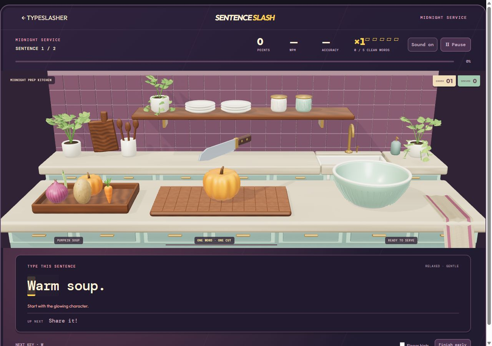
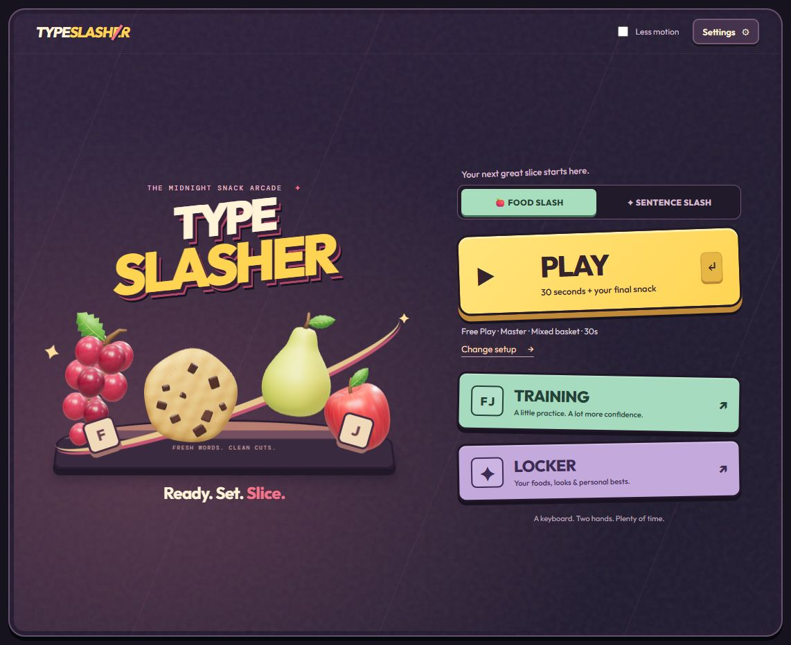
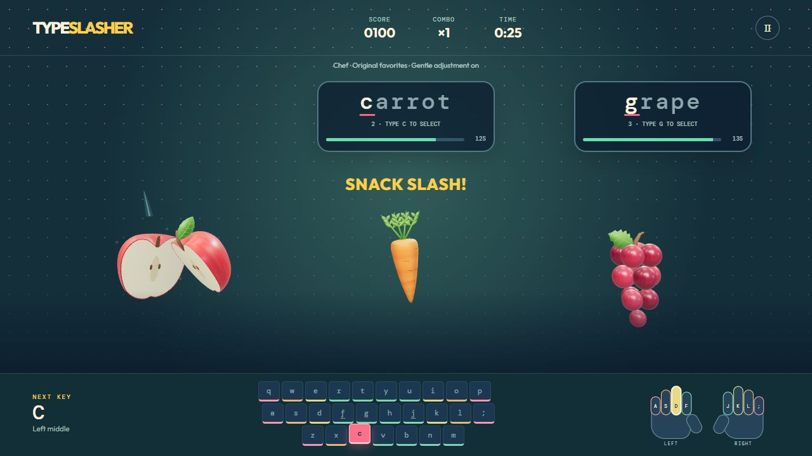
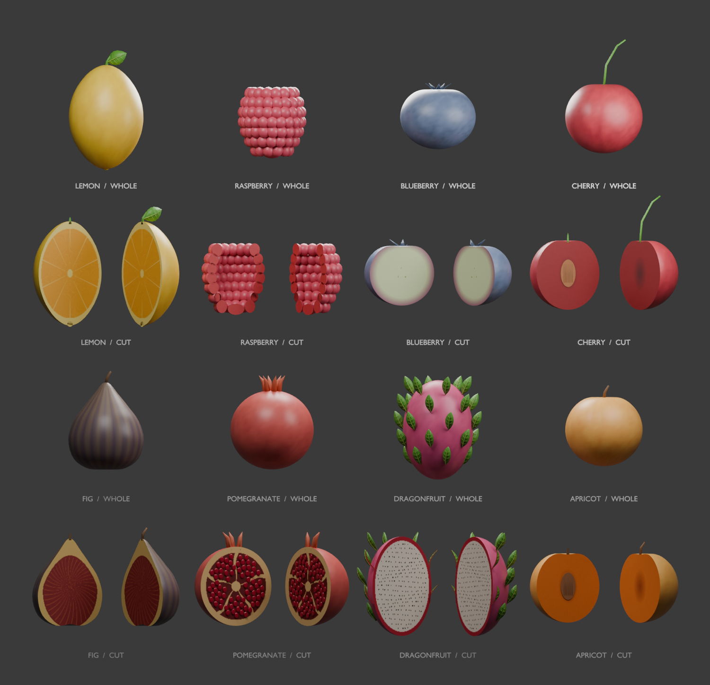
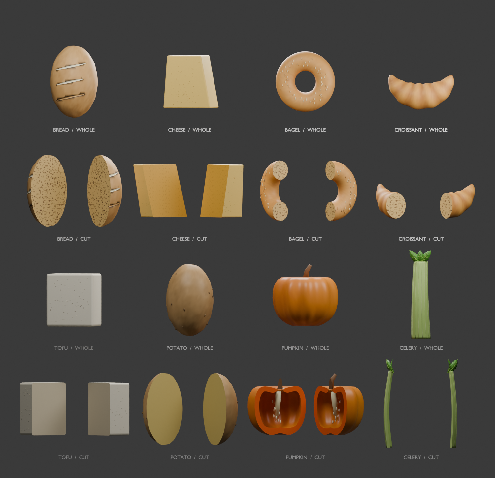
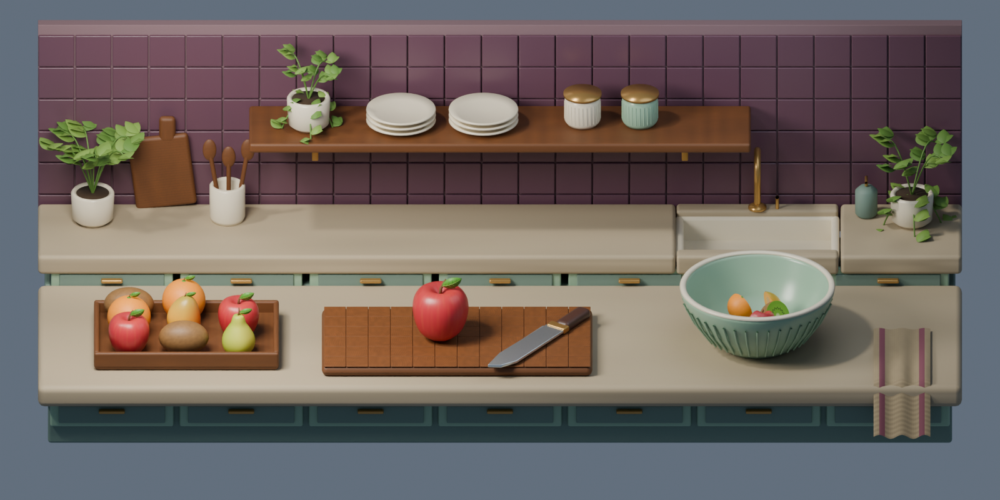

# Typeslasher

**Type a word. Slice a snack. Turn a paragraph into a kitchen service.**

Typeslasher is a browser typing arcade by **Kazi Ahmed**. It combines keyboard practice with 50 custom 3D foods, a cozy modeled kitchen, and immediate visual feedback. Built with TypeScript, Three.js, and Blender through an iterative, AI-assisted development process.



**Current version:** 1.6.0 · **Platform:** desktop/laptop browser with a physical QWERTY keyboard

[Development story](docs/DEVELOPMENT.md) · [Player guide](docs/PLAYER_GUIDE.md) · [Asset pipeline](ASSETS.md) · [Credits](THIRD_PARTY_NOTICES.md)

## What you can play

| Playstyle | What happens |
| --- | --- |
| **Food Slash — Free Play** | Type the names of flying foods to slice them. Choose a food basket, pace, challenge, and a 30/60/90-second round. |
| **Food Slash — Arcade** | Continue through rounds with gradually shorter typing windows and more simultaneous targets. |
| **Food Slash — Beat Kitchen** | Finish words near the musical beat for an optional timing bonus. |
| **Sentence Slash** | Choose an illustrated story/recipe tile or write/paste a passage under + Add your story. Words cut a fixed batch of ingredients; sentences serve orders. Choose a story or your own text and press Start. Play relaxed or beat each recipe card’s timer. |

Finger hints and home-row drills help players practice. Adjustable pace, reduced motion, sound controls, and graphics presets make sessions easier to tailor. Recent results, key practice, and personal bests stay in the browser; no account is required.

## Gameplay and art

### Homepage artwork



The snack arcade introduces the game with a food-filled counter, oversized keycaps, and a plum, cream, yellow, and mint palette.

### Food Slash



Each active food has a different first letter. Start typing its name to select it, then finish the word to cut the model. Longer words receive more time. Accuracy, combos, and completed slices shape the score.

### Whole foods and cut interiors


The 50 foods span seven packs: Original favorites, Fresh picks, Snack break, Big bites, Garden harvest, Fruit market, and Pantry & comfort. Every food has an intact model and two modeled cut pieces. Seeds, peel, pits, crumb, rings, and hollow interiors make slicing part of the art as well as the scoring.

<details>
<summary>More asset screenshots</summary>







The food sheets and kitchen render show the actual Blender assets. Gameplay captures show the browser version. Generated concept references live separately in `design/`.

</details>

## How it was developed

The project grew in stages: establish a reliable typing loop, replace simple shapes with modeled foods, build practice and progression, refine the arcade interface, introduce paragraph typing, then expand the kitchen and food catalog.

Human direction and review guided the work, with Codex assisting planning, implementation, debugging, and iteration. Blender and Python produced editable models and browser-ready GLB exports. Built-in image generation supplied kitchen concepts and whole/cut food reference sheets; those references guided modeling rather than replacing the playable geometry.

Iteration changed both appearance and behavior. The asset records document revised kiwi anatomy, ruby grape materials, and pineapple detail. Kitchen refinements addressed camera framing, cut/transfer order, punctuation handling, and animation backlogs during fast typing. The game counts every word while keeping decorative cuts responsive to the player's current input.

The repository begins with a snapshot of the 1.6 project. Saved plans and release checkpoints preserve its earlier development story. Read the [full process and tool breakdown](docs/DEVELOPMENT.md).

## Tools used

| Tool | Purpose |
| --- | --- |
| **TypeScript + HTML/CSS** | Gameplay logic, input, scoring, menus, and responsive UI. |
| **Three.js** | 3D rendering, GLB loading, lighting, and slice/kitchen animations. |
| **Blender + Blender MCP** | Editable food and kitchen assets, scene refinement, and review. |
| **Python** | Procedural modeling, texture work, export, and asset/menu renders. |
| **Vite + Node.js + npm** | Local development, static builds, and automated checks. |
| **Codex + built-in image generation** | AI-assisted development and documented visual references. |
| **Web Audio API** | Synthesized music/effects and rhythm cues. |

AI assistance is part of the development process. There are no AI requests, analytics, advertisements, or cloud saves during gameplay. Models and fonts are served locally by the site. Custom passages remain in memory for the current visit; recent practice results can be saved in browser storage.

## Run locally

Install **Node.js 22.12+**, then:

```sh
npm ci
npm run dev
```

Open the address printed by Vite, normally `http://localhost:5173/`. Use a physical QWERTY keyboard. Open `/assets.html` for the rotatable whole/cut food studio.

On Windows, `Play Typeslasher.cmd` serves an existing production build at `http://127.0.0.1:5173/`. Run `npm run build` first. Progress is specific to the browser and site address.

## Check and build

```sh
npm run check
npm run build
npm run check:release
npm run play
```

The 17 check suites cover typing/timing, progression, local records, rhythm, paragraph scoring, kitchen sequencing, catalog rules, and exported food geometry. Production checks verify relative links, local font licenses, and asset size budgets. Saved browser playthroughs and remaining device coverage are documented in [STATUS.md](STATUS.md).

`dist/` contains the static website. The build uses relative asset links for subfolder hosting. Play the published game at [kaziahmed.net/typeslasher](https://www.kaziahmed.net/typeslasher).

## Project structure

```text
src/              Gameplay, UI, rendering, audio, and local progress
public/assets/    Browser-ready food packs and kitchen GLB
public/fonts/     Local fonts and their licenses
tools/            Modeling/export scripts and automated checks
design/           Art references, prompts, textures, and UI prototype notes
art-review/       Saved visual reviews and gameplay checkpoints
docs/             Player guide, development story, and showcase screenshots
*.blend           Editable Blender source projects
```

## Credits and reuse

Project foods, kitchen, synthesized audio, and game code were created for Typeslasher with the development tools described above. Three.js uses the MIT license; Outfit and DM Mono use the SIL Open Font License. See [THIRD_PARTY_NOTICES.md](THIRD_PARTY_NOTICES.md) and the bundled notices.

No project-wide reuse license has been selected yet. The repository is public for inspection; third-party components retain their own licenses.
