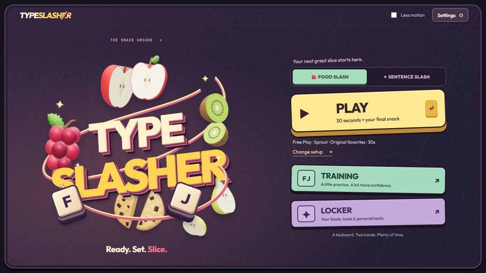
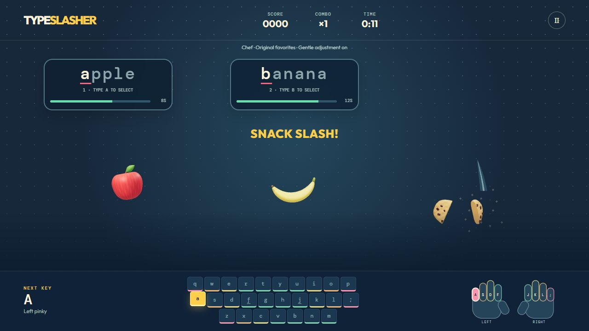
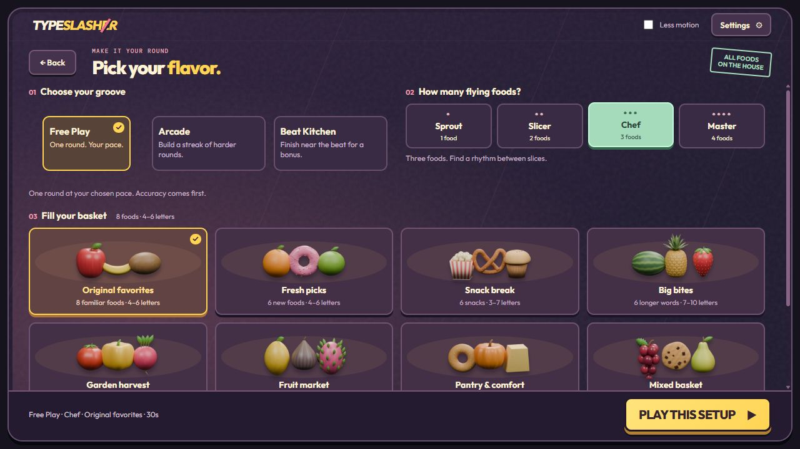
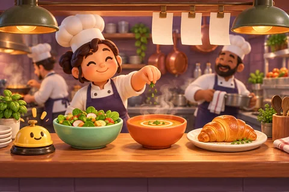
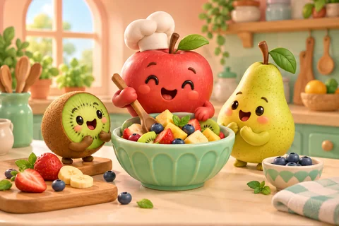
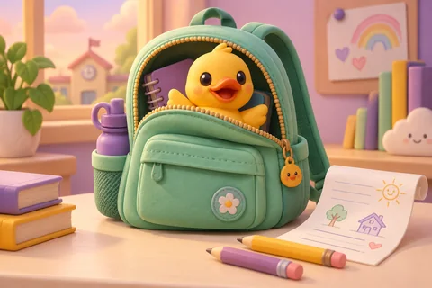
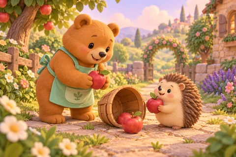
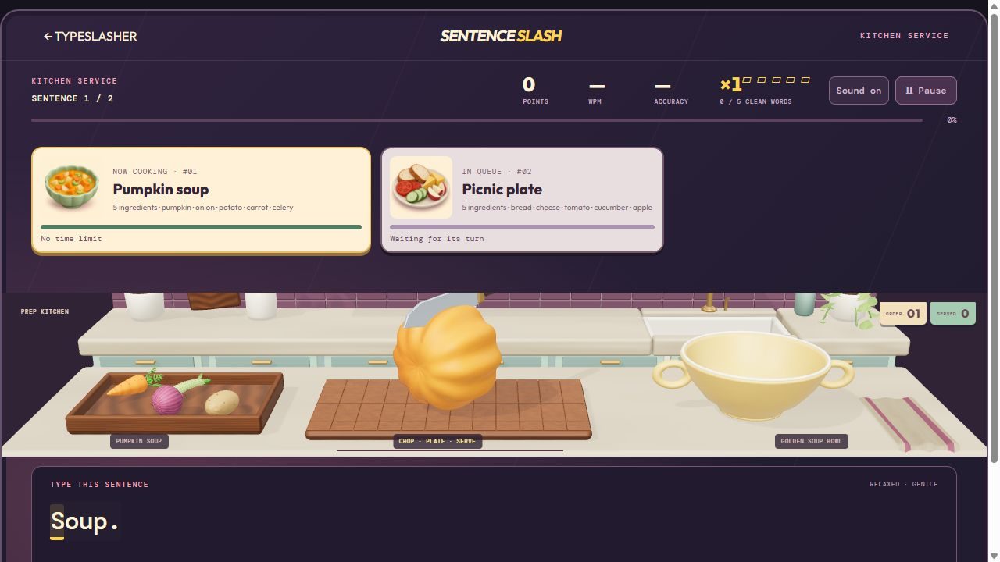
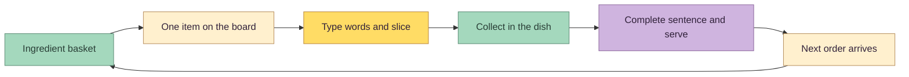

<div align="center">

# TYPE SLASHER

### Type a word. Slice a snack. Serve a story.

A playful 3D typing arcade by **Kazi Ahmed**, built for a keyboard and a little appetite.

**[▶ PLAY THE GAME](https://www.kaziahmed.net/typeslasher)** · **[Player guide](docs/PLAYER_GUIDE.md)** · **[How it was made](docs/DEVELOPMENT.md)** · **[Explore the 3D foods](https://www.kaziahmed.net/typeslasher/assets.html)**




**Version 1.6.0** · TypeScript · Three.js · Blender · Vite

</div>

## A small arcade for your keyboard

Typeslasher turns typing practice into visible, satisfying progress. Flying foods split when you finish their names. In the restaurant kitchen, your words prepare ingredients and your sentences serve orders. Practice for a quick round, follow a story, or bring a passage of your own.

The game runs in a desktop or laptop browser with a physical **QWERTY keyboard**. No account is required. Scores and practice records stay in your browser.

## Choose your way to play

| Playstyle / mode | The idea | What you control |
| --- | --- | --- |
| **Food Slash · Free Play** | A single snack-slicing round. Type a food's name and watch it split. | Food basket, pace, 1–4 targets, and a 30/60/90-second round. |
| **Food Slash · Arcade** | Keep going through successive rounds. New foods get less typing time, and another target joins every three rounds, up to four. | Starting challenge, basket, and pace; take a breather between rounds. |
| **Food Slash · Beat Kitchen** | The same typing loop with a 120 BPM rhythm. Finish near a beat for a bonus. | Normal food settings, music/effects, and an optional timing adjustment. |
| **Sentence Slash · Relaxed service** | Follow a story or your own passage. Prepare and serve each sentence without an order deadline. | Story, Gentle/Exact typing, and the first recipe. |
| **Sentence Slash · Rush service** | Each order has a freshness timer. Serve it before time runs out. | Story, typing style, first recipe, and a 20/30/45/60 WPM target pace. |

### Food Slash: ready, set, slice



Start a word with its first letter to select that food. Active targets have distinct initials, so your choice is unambiguous. Finish the word to slice it; no Enter key is needed. Longer names receive more time. Clean typing builds a combo up to **×5**.

**Sprout, Slicer, Chef, and Master** offer one, two, three, and four simultaneous targets. Free Play can gently adjust future deadlines as you improve. Beat Kitchen adds **25 points** for a finish within 90 milliseconds of a beat; missing the beat adds no extra penalty.

<details>
<summary><strong>See the food basket and round setup</strong></summary>



Seven packs cover fruit, vegetables, snacks, and pantry favorites. Choose Original favorites, Fresh picks, Snack break, Big bites, Garden harvest, Fruit market, Pantry & comfort, or a mixed basket. Every pack is available immediately.

</details>

### Sentence Slash: are you hungry for a good story?

Choose one of six illustrated stories, or use **+ Add your story** to write or paste your own text. Your draft stays intact while you browse the menu. Press **Start** to head straight into the kitchen.

<table>
<tr>
<td align="center" width="33%"><br><strong>Restaurant shift</strong><br>10 orders · A full kitchen service</td>
<td align="center" width="33%"><br><strong>Fruit adventure</strong><br>4 orders · A tiny chef’s sunny lunch</td>
<td align="center" width="33%"><br><strong>Space mission</strong><br>3 orders · Follow the stars home</td>
</tr>
<tr>
<td align="center"><br><strong>Funny day</strong><br>3 orders · A duck ate the homework</td>
<td align="center"><br><strong>Little kindness</strong><br>5 orders · Make room for a friend</td>
<td align="center"><br><strong>Helping paws</strong><br>5 orders · A tumble becomes a picnic</td>
</tr>
</table>

*The story tiles use generated illustrations created for the game. The kitchen and food in gameplay are rendered 3D models.*



The six stories include **30 illustrated pages**, one for each sentence. Pictures start in black and white and gain color through soft watercolor brush marks as you type correctly. Each new sentence brings the next picture; the characters and settings stay consistent.

Every sentence becomes an order with a **fixed batch of ingredients**. Completed words unlock evenly spaced milestones: one ingredient smoothly arrives, gets cut, and moves into the dish. The final milestone triggers the last cut alongside the sentence slash, then the completed dish is served. All cuts finish before the next batch arrives.



Recipe cards show the current order and the next two. The **ten-recipe menu cycles through every dish before repeating**. In Rush, the active card's timer starts when the order reaches the kitchen; queued orders wait. An expired order clears the basket, board, and dish, signals the loss, and moves on. Pausing and cut/serve animations do not consume the order timer.

**Gentle** ignores letter case; **Exact** requires it. Both include punctuation. Spaces are normal typing, and Backspace corrects the marked mistake. Longer sessions show a speed chart, alongside accuracy, points, streaks, served orders, and lost orders.

### A different dish for every recipe


Fruit mixes, salads, roasted vegetables, berries, tofu, soup, picnics, and bakery breakfasts each have their own vessel. Seven bowls, two plates, and a roast platter include scalloped rims, wood grain, oval shapes, and soup handles. Food placement follows the selected dish's shape and depth.

## Practice, comfort, and progress

- **Training / Prep School:** four home-row lessons, a finger guide, and local key-level practice records. The guide suggests fingers; it does not detect your physical hand position.
- **Locker:** recent sessions, personal bests, and earned kitchen looks. Watermelon Pop unlocks after 10 lifetime slices; Citrus Rush after 25.
- **Sound & feel:** synthesized music and effects, separate volume controls, mute, reduced motion, and optional camera nudges.
- **Graphics:** Battery saver, Balanced, and Crisp presets. Menus and paused scenes avoid continuous rendering; food packs and the kitchen load when needed.
- **Local text:** custom passages remain in memory for the current visit. Only practice results and preferences may be stored locally. Game code makes no runtime AI requests and includes no advertising or analytics.

| Control | Action |
| --- | --- |
| **Letters** | Select and slice flying foods, or type the highlighted sentence. |
| **Space / punctuation** | Type them normally in Sentence Slash. |
| **Backspace** | Correct a marked Sentence Slash mistake. |
| **Escape** | Pause. Continue, Retry, Settings, and Exit are available in both playstyles. |

## How it was made

Typeslasher is a project by **Kazi Ahmed**, developed through human direction, hands-on review, and AI-assisted iteration with **Codex**. The work grew from a typing loop into a small food arcade and then a restaurant service.

| Part | Tools and process |
| --- | --- |
| **Game and interface** | TypeScript, semantic HTML/CSS, and Three.js handle input, timing, scoring, local progress, menus, 3D rendering, and animation. Vite produces the static release. |
| **50 playable foods** | Blender, Blender MCP, and Python produce editable meshes, painted materials, interior details, and GLB exports. Each food has an intact model and two complementary cut pieces. |
| **Kitchen** | A generated concept guided an editable Blender scene with daylight, a sink, plants, utensils, textured counters, and a cutting board. |
| **Serving dishes** | Three.js geometry creates ten closed, hollow bowls and plates, with recipe-specific shapes, materials, rims, handles, and food placement. |
| **Illustrated cards** | Built-in GPT image generation created the recipe cards and six story illustrations. Optimized WebP files are saved with the project; prompts and originals are preserved. |
| **Sound** | The Web Audio API synthesizes music, effects, and rhythm cues. No third-party music recordings are used. |
| **Review and release** | Automated checks, browser playthroughs, Blender turnarounds, and the interactive food studio validate the result. The static game is published through the portfolio's Vercel deployment. |

The latest food pass refined silhouettes, cut interiors, relative scale, and natural resting poses. All 50 foods were reviewed from **seven views**; the serving dishes from **six views**. The floating home artwork reacts gently to the pointer, and the story headline drops into place with a small landing bounce. Reduced motion offers a still presentation.

<details>
<summary><strong>Explore the food art and development records</strong></summary>


The [live food studio](https://www.kaziahmed.net/typeslasher/assets.html) lets you rotate whole and cut models, inspect multiple views, and compare game sizes. Editable Blender files remain in the repository.

- [Full development story and architecture](docs/DEVELOPMENT.md)
- [Food modeling/export pipeline](ASSETS.md)
- [Whole/cut food reference prompts](design/food-expansion/PROMPTS.md)
- [Story illustration prompts](art-review/stories/PROMPTS.md) and [kindness/helping prompts](art-review/stories/KINDNESS-PROMPTS.md)
- [Release checkpoints and review evidence](STATUS.md)

</details>

## Run it locally

Use **Node.js 22.12+** and npm:

```sh
git clone https://github.com/pixelsncodes/typeslasher.git
cd typeslasher
npm ci
npm run dev
```

Open the address printed by Vite, normally `http://localhost:5173/`. Open `/assets.html` for the food studio. Progress belongs to the browser and site address, so local and published games keep separate records.

```sh
npm run check          # 18 suites: gameplay, storybooks, timing, scoring and 3D assets
npm run build          # Type-check and build the static site
npm run check:release  # Portable links, local fonts/licenses and asset budgets
npm run play           # Serve the production build on 127.0.0.1:5173
```

On Windows, **Play Typeslasher.cmd** also serves an existing build. The `dist/` folder is the deployable site; relative asset links support subfolder hosting. See the [player guide](docs/PLAYER_GUIDE.md) for the full controls and setup details.

## Inside the repository

```text
src/              Gameplay, menus, rendering, audio, and local progress
public/assets/    Food/kitchen GLBs, recipe cards, and story artwork
public/fonts/     Locally served fonts and their licenses
tools/            Modeling/export scripts and 18 automated check suites
design/           Concepts, reference prompts, textures, and interface studies
art-review/       Turnarounds, original generated artwork, and browser reviews
docs/             Player guide, development story, and current screenshots
typeslasher-*.blend  Editable food packs and kitchen projects
```

## Credits and reuse

Project code, foods, kitchen, serving dishes, synthesized audio, and illustrations were created for Typeslasher using the workflow above. Three.js uses the MIT license; **Outfit** and **DM Mono** use the SIL Open Font License. See [THIRD_PARTY_NOTICES.md](THIRD_PARTY_NOTICES.md) for credits and bundled license paths.

No project-wide reuse license has been selected. This public repository is available for inspection; third-party components retain their own licenses.

<div align="center">

**A keyboard. Two hands. Plenty of time.**

**[Ready for your next slice? Play Typeslasher →](https://www.kaziahmed.net/typeslasher)**

</div>
