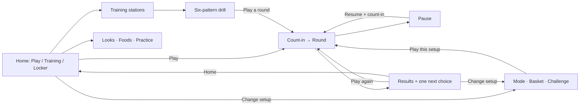

# Typeslasher — UI and experience refresh

Status: UI-1 is approved and UI-2 is integrated into the playable game at `/`.
Home, Setup, and Results use the new design and real game state. Training,
Settings, and Locker lead to working features. See `STATUS.md` for validation.
UI-3's deeper panel redesign and UI-4 remain planned. The standalone prototype
source is retained as design history; normal builds serve the integrated game.

## The design decision

Make the menus feel like entering a small, colorful midnight snack arcade.
Typeslasher needs a recognizable title screen, an inviting place for its food
characters to appear, and a fast route into play. Its identity should come from
the food, slicing, keyboard keys, and music already in the game.

Aim at a 12-year-old: energetic, tactile, slightly mischievous, and satisfying.
Use strong silhouettes, crisp lettering, and a few expressive moments. Avoid
preschool presentation, constant mascot chatter, and rewards that pressure the
child to return every day. Essential practice and food choices stay available.

The main change is hierarchy and navigation. A font or palette swap alone would
leave the current settings-form experience intact.

## What the audit found

Live review covered the home screen, mode and basket selection, finger guide,
lesson list, active lesson, lesson completion, saved notebook, sound settings,
expanded rhythm setup, countdown, Beat Kitchen arena, pause, and results. Home
was also checked at 390 × 640. The desktop viewport was 1280 × 720. Test activity
used localhost's separate notebook, not the child's 127.0.0.1 notebook.

Loading, startup failure, storage failure, reset, and calibration outcome states
were reviewed in source. They were not all forced in the browser. The food
studio was visually reviewed during the preceding asset work. This is a design
audit, not a replacement for device performance tests or the child's playtest.

| Area | Observed problem | Proposed change | Priority |
| --- | --- | --- | --- |
| Home | Large promotional slogan beside a column of controls; no food scene. The game name has little presence. | A distinctive Typeslasher title and food tableau, with Play as the dominant action. | First |
| Setup | Mode, pace, basket, challenge, look, and adaptation compete before play. | Remember a ready-to-play setup; put optional changes in one dedicated setup screen. | First |
| Mode choice | Two small text cards differ mainly in their labels. | Give Arcade and Beat Kitchen their own illustrated identity and a short behavior preview. | First |
| Basket choice | Food names are hidden in a dropdown and an external-looking studio link. | Show five trays with recognizable food thumbnails and visible word-length examples. | First |
| Challenge | Child must reason about challenge, pace, and adaptation together. | Present challenge with visible food-count pips; put typing time beneath it and automatic adjustment under More options. | First |
| Kitchen looks | A disabled select option and a sentence carry the whole reward. | A visual look selector with preview, progress, and an explicit equipped state. | Second |
| Guide | A full instruction sheet interrupts entry. | A brief, skippable, interactive F/J introduction plus an always-available guide. | Second |
| Training | Four near-identical rows lead into another tall blue dialog. Active practice scrolls at 720px height. | Four compact training stations and a full training screen with the current pattern, hands, and controls visible together. | Second |
| Lesson finish | After finishing a warm-up, the advice says to do a warm-up. | Use completion-aware copy and offer Play as the main next action. | Second |
| Notebook | Long explanatory text, record labels, and raw key statistics dominate. | Lead with the next useful practice choice; put detailed records and key statistics behind clearly labeled views. | Second |
| Pause | Resume sits between two form controls, with more actions below. | Resume first, settings second, end round separated at the bottom. | First |
| Results | A report panel; bests, rhythm bonuses, unlocks, advice, and save status share a paragraph. | A celebratory stage with readable results and one contextual next step. | Second |
| Sound/settings | Native sliders, checkboxes, and advanced timing instructions make a long form. | A compact options panel with Sound, Comfort, and Display sections; a dedicated optional rhythm setup. | Second |
| Small screens | Setup consumes the viewport and Play requires scrolling. | A compact title scene and always-visible main action; setup has its own scroll area. | First |
| Overall | Thin borders, translucent blue panels, tiny uppercase labels, and repeated dialog layouts blur screen identities. | A consistent arcade visual system with distinct title, setup, training, and reward compositions. | First |

Keep the existing strengths: accurate food names, forgiving letter acceptance,
clear finger mapping, generous beginner timing, pause safety, local progress,
optional rhythm, and the recognizable 3D foods. Accuracy already leads the
displayed scorecard; retain that ordering.

## Art direction: the midnight snack arcade

The title screen is a small stage, with a dark plum/ink arcade surround and a
warm illuminated counter. A large dimensional Typeslasher wordmark anchors it.
Three or four existing foods arc over a painted slash, with a few oversized
keyboard keys near the counter. Keep a clean zone around navigation.

Use these three recurring shapes: a diagonal slash for emphasis, an oversized
keycap for actions, and a tray for choosing food. Use them consistently rather
than giving every control a new decorative treatment.

- **Palette:** ink/plum background, cream lettering, golden-yellow Play button,
  watermelon-red highlights, and mint for practice/confirmation. Keep the
  existing finger-zone colors fixed; decoration must not redefine their meaning.
- **Type:** build a custom Typeslasher wordmark. Use a compact, heavy display
  treatment for short screen titles. Keep Outfit for clear supporting text and
  DM Mono for actual typing. Do not stretch, rotate, or decorate target words.
- **Surfaces:** painted cabinet panels, subtle grain, opaque fills, thick edges,
  and short colored shadows. The food remains the most detailed part of a scene.
- **Buttons:** generous keycap faces with visible press depth. Selected choices
  need a label/check and a strong edge, not color alone. Use labeled controls.
- **Motion:** one brief food entrance on arrival, a small response to selection,
  a slash wipe between major screens, and a restrained result celebration.
  Text and controls are immediately usable; animation never delays input.
- **Sound:** soft navigation ticks and a distinct confirm sound, only after a
  user gesture and subject to existing sound preferences. No sound on every
  pointer movement and no background sound when paused or hidden.

A little supporting guide character can come later if the scene still needs
personality. Start with the food and keycaps already available; do not put faces
on all the foods or create a large character production task up front.

## Navigation and screen behavior

### 1. Title / home

At laptop size, place the title and food stage across roughly the left three
fifths. On the right, use a large Play keycap, then Training and Locker. Put
Settings in a consistent labeled corner position. Show one compact setup line
under Play: `Arcade · Sprout · Fresh picks`, with `Change setup` beside it.

First visit: default to Arcade, Sprout, Relaxed, Original favorites, full guide,
and existing gentle adjustment. Play opens the short introductory interaction;
an explicit Skip goes straight to the countdown. Returning players use their
last valid setup and enter the countdown in one activation.

Use Typeslasher itself as the main title. Supporting copy can be simply
`Ready. Set. Slice.` The current “Type fast” instruction should no longer set
the expectation for a beginner.

Primary actions remain visible at 1280 × 720, 1024 × 600, and a compact layout.
Do not keep the live HUD or typing deck exposed to keyboard focus beneath home.

### 2. Change setup

One screen, rather than a sequence of compulsory menus:

- **Mode:** Arcade / Beat Kitchen, each with one sentence and a tiny visual
  demonstration. Beat copy: `Finish near the beat for a bonus.` Make it clear
  that individual letters do not need to be typed in rhythm.
- **Food basket:** five trays, with three representative thumbnails each. Show
  selected contents and a sample word. Mixed/Sprout visibly says `Short words`.
  Big bites shows a longer sample such as `watermelon` before selection.
- **Challenge:** Sprout / Slicer / Chef / Master, illustrated with 1/2/3/4 foods.
  Keep the existing internal presets and timing; do not silently rebalance them.
- **Typing time:** three clearly labeled choices with a short explanation.
  Keep the same Relaxed / Steady / Brisk values. Automatic adjustment stays on
  by default and is explained inside `More options`.

Show a persistent `Play this setup` action and Back. Save choices as today, but
do not start a round until Play is explicitly activated. Kitchen looks live in
Locker so they do not complicate round setup.

### 3. Training and finger guide

Rename the main menu entry to Training. Present the existing four lessons as
small stations: F + J, Left hand, Right hand, Both hands. Show the actual keys
and approximate scope (`6 short patterns · no timer`). All remain available.

The first-run guide has three small beats: find F/J, try alternating them, then
type one short food word without a timer. Show one instruction at a time. Allow
skip and replay. Successful keystrokes confirm keys, not physical finger use.

In training, each completed pattern adds an ingredient to a six-slot tray. This
gives a visible purpose to `fjfj` without changing the curriculum. Keep the word,
keyboard, and hands together in a stable area. Keep Back and guide controls
visible. A mistake preserves correct letters and points to the next key.

Completion copy refers to the activity just finished: `F and J warm-up done.`
Primary action: `Play a round`. Secondary: `Try another drill`. Only recommend
another drill when there is a specific reason, and explain it in one sentence.

### 4. Locker and progress

Use three clearly labeled views: **Kitchen looks**, **Food collection**, and
**My practice**. “Collection” means a browsable catalog; all 26 foods remain
available from the beginning.

Kitchen looks displays actual scene previews and the existing slice-based unlock
progress. Equipping changes appearance with a visible `Using this look` state.
An unavailable look can be previewed and explains exactly how it unlocks.

Food collection shows each food with its name, word length, and whole/cut toggle.
Reuse the studio's assets and interaction, with the game's menu styling and a
clear return route. Keep the development studio available separately.

My practice opens with one useful next activity, followed by accuracy and slices.
Separate detailed key practice, recent sessions, and comparable personal bests.
Default the best-score view to the current setup so a long matrix does not fill
the screen. Describe progress as practice data, not proof of typing mastery.

No new currency, XP economy, daily streak, shop, leaderboard, or battle pass is
needed for this refresh. Reward moments can use existing milestones. If persistent
lesson stamps are added, store actual lesson completion IDs prospectively. Current
aggregate totals and 12-session history cannot prove every past lesson completion.

### 5. Pause and round transitions

Pause presents `Keep slicing` first, followed by `Settings` and a separated
`Finish this round`. Show the frozen food dimly behind it. Explain that finishing
saves the current score; avoid making Finish look like an unrelated navigation
button. Keep the existing countdown when resuming and preserve word deadlines.

Settings opened from pause returns to pause; closing it must never resume a
round on its own. Changing typing time applies only to future foods and keeps
the existing mixed-pace record rule.

Count-in uses three large keycaps and then a short slash reveal. No extra
“Press any key” screen between Play and the count-in.

### 6. Results

Use a tray or podium composition with a small group of sliced foods. Lead with
accuracy, then slices and score. A personal best or new look gets its own small
celebration, separate from practical advice and save status.

Main action: `Play again`. Secondary: `Change setup`. A quiet Home action is
always available. Offer one optional next step such as a named drill or a new
look to try. Do not suggest faster play solely because accuracy was high in a
tiny sample. Keep the current score and record math intact.

Create distinct honest states: no keys typed, a short round ended by the player,
ordinary completion, personal best, and new look unlocked. An early exit should
say `Round finished`, not imply the entire 90-second challenge was completed.
Show low or negative scores without humiliating language or fake rewards.

### 7. Settings, calibration, and recovery

Group options into Sound, Comfort, and Display. Use large sliders/toggles with
plain labels and a persistent Done button. Show current choices without long
explanatory paragraphs. Keep reset-progress inside a separate local-data area
with the existing explicit confirmation.

Beat timing opens a focused panel: four listen dots, eight tap slots, and a
simple success/retry result. Keep the numerical offset under Fine tuning.
Preserve its existing cancellation, pause, and unavailable-audio behavior.

Food loading uses a packing tray and the real pack name. Show a percentage only
when measured; otherwise show honest indeterminate progress. Failure provides
Retry and Choose another basket. A startup graphics failure has Reload and a
clear explanation. Storage unavailable is a quiet persistent notice, not repeated
as the last sentence of every celebration.

## Flow blueprint

Settings is reachable from home and pause, with a consistent return destination.
First-visit Play inserts the skippable introduction before count-in.

## Build order and model recommendations

These are task-specific recommendations, not automatic model switches or promises
about Plus allowance. Announce the model before each phase. All generated art,
Blender props, and visual asset corrections use Astra, as requested.

| Phase | Concrete delivery | Model / effort | Completion gate |
| --- | --- | --- | --- |
| UI-1: visual prototype | One cohesive title, setup, and results prototype with real food renders, keycap buttons, palette, and transition examples. | Astra / medium | Review at laptop and compact sizes; it reads as Typeslasher without relying on the slogan. |
| UI-2: menu integration | Home, quick play, setup, pause, navigation/focus handling, saved setup, loading/retry. | Sol / medium | Returning player starts in one action; all existing choices still work; countdown and loading cannot be bypassed. |
| UI-3: training and rewards | Short intro, training stations, pattern tray, completion-aware advice, Locker, results, organized settings/calibration. | Sol / medium; Astra / medium for any new art | Complete lesson → play → results → replay and pause → settings → resume with correct data and focus. |
| UI-4: polish and child playtest | Motion/sound pass, responsive layouts, keyboard audit, fallback states, performance and release. | Astra / medium for visual review; Sol / medium for routine fixes and checks | The child can start, change basket, practice, pause, and explain the result without coaching. |

Do UI-1 before propagating a visual system across every panel. Refine that small
set if it still resembles a product landing page. This avoids spending the
weekly allowance polishing a direction that does not solve the actual problem.

## Implementation guardrails

Keep Three.js, TypeScript, and semantic HTML/CSS. Extract menu rendering from
`src/main.ts` into focused modules, with a single navigation/focus controller.
Remove superseded CSS as each screen moves over rather than adding another
layer of overrides to `src/styles.css`. No framework migration is needed.

Reuse `food-catalog.ts`, the current per-pack loader, game timing, targeting,
scoring, learning store, preferences, and audio. One renderer can show the home
food scene and arena. Small baked thumbnails serve basket/look choices; avoid
26 simultaneous 3D previews or downloading all four packs just to show home.

Plan a small reusable art set: Typeslasher wordmark, cabinet/counter backdrop,
keycap/button treatment, slash transition, five basket thumbnail compositions,
three kitchen-look previews, and four training symbols. Render the food thumbnails
from existing Blender models. Target no more than 1.5 MB of additional compressed
menu art; measure before release. Keep source files editable.

Menu navigation must keep background screens inert, show a clear focus marker,
return focus to the opener, and support Tab/Shift+Tab, Enter/Space, and Escape.
Arrow keys can select within mode/challenge groups without replacing normal Tab
navigation. Menu shortcuts must never type into the game behind a panel.

Use at least 44px main control targets and readable body copy at standard laptop
size. Keep important text horizontal and pair colors with labels. Respect reduced
motion across the entire menu system; pause decorative rendering when idle/hidden.
Keep the keyboard guide and target labels steady during all effects.

Preserve storage keys and earlier records. Any added persistent fields need
defaults and a tested migration; no existing progress is inferred or invented.

## Acceptance checks

1. A returning player sees and activates Play without scrolling or changing a setting.
2. A new player can find F/J and reach an actual food with minimal reading; Skip works.
3. Basket choice shows the foods and longer-word expectation before a round starts.
4. A complete drill gives activity-specific feedback and a direct route into play.
5. Pause freezes play; nested settings returns to pause; resume preserves deadlines.
6. Results explain the round with one glance and separate celebration from advice.
7. Every screen has a clear Back/Home route and correct keyboard focus.
8. At 1280 × 720, 1024 × 600, and 390 × 640, controls do not overlap; primary actions
   remain visible. Compact layouts still clearly require a physical keyboard for play.
9. Loading, failed assets, blocked storage, no audio, zero-input results, and locked
   looks each have understandable actions and honest feedback.
10. Existing gameplay/learning checks pass; menu-specific tests cover navigation,
    input isolation, persistence, and asynchronous loading. Compare frame rate and
    transfer size on the same laptop before and after the refresh.

Child playtest prompts: “Start a round”; “Try different foods”; “Find the F/J
practice”; “Take a break and resume”; “What did you improve?” Observe hesitation
and mistakes. Then ask whether the art feels exciting or too young. Use those
answers to tune the next pass; this adult audit cannot establish the child's taste.

## References and judgment

The proposed compositions, copy, navigation, and priorities above come from this
game's audit and the user's brief. [Taste Skill's redesign audit](https://raw.githubusercontent.com/Leonxlnx/taste-skill/main/skills/redesign-skill/SKILL.md)
was used as a consistency check. Its business-site defaults, such as reducing
everything to one accent color, do not override this colorful arcade direction.

[OpenAI's Astra documentation](https://developers.openai.com/api/docs/models/gpt-6-astra)
and [Sol documentation](https://developers.openai.com/api/docs/models/gpt-5.6-sol)
were checked for the named models. Phase assignments are our practical judgment;
API prices do not establish how many tasks the user's Plus allowance will support.
