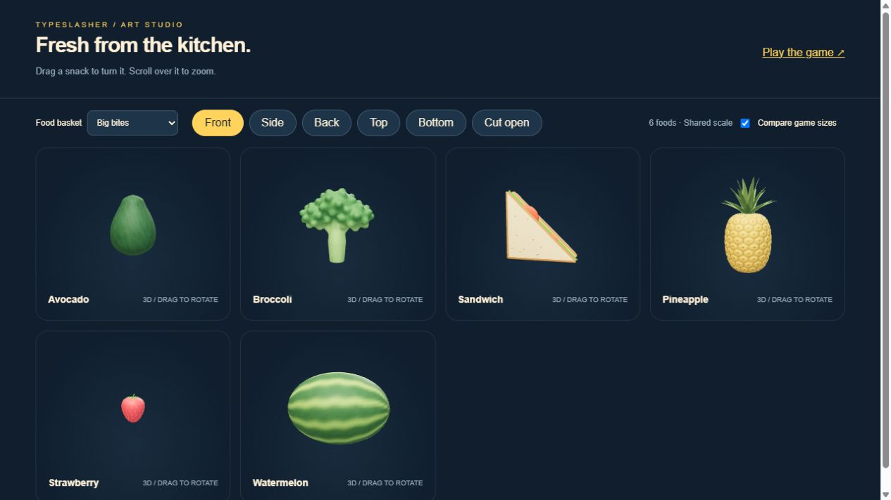
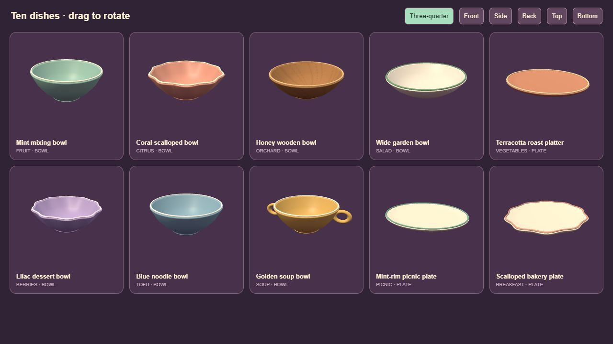

# Developing Typeslasher

Typeslasher explores a simple idea: make keyboard practice feel like a small arcade game. Typing a recognizable food name produces a visible reward: the food splits into modeled pieces. Paragraph practice extends that idea into preparing and serving a meal.

This account is reconstructed from the saved plans, source files, art reviews, and release checkpoints. Those records describe the evolution of the project; the initial GitHub commit is a snapshot of version 1.6, not a recreated commit history.

## 1. Establish the typing loop

The initial plan prioritized a playable loop before polished art: select a target by its first letter, finish its name, slice it, and get the next target. The project uses TypeScript, Three.js, and semantic HTML/CSS, with Vite for development and production builds.

Gameplay and practice logic are split into focused modules for timing, challenge, progression, rhythm, preferences, and learning records. Active targets have distinct first letters so selecting a food is unambiguous. Longer names receive more typing time. Pause and resume handling keep time away from the keyboard out of the results.

## 2. Replace simple food shapes with modeled assets

The first eight foods became an editable Blender pack. Each food has an intact model and two complementary cut pieces, including visible interiors. Python scripts build and export the geometry, materials, and textures as browser-ready GLB files.

Art review was iterative. Saved revisions document the move to a brown whole kiwi with a green interior, more recognizable apple proportions, and ruby grapes with pink flesh. A later pineapple revision added a more detailed rind and layered crown. The interactive food studio reviews the exported models using the game's loader and lighting, because a Blender render alone does not establish how an asset will look in the browser.

## 3. Make practice approachable

Finger guidance, home-row drills, adjustable pace, and local learning records support short practice sessions. The arcade interface developed through a separate home/setup/results prototype before being connected to real rounds. It introduced the plum, cream, yellow, and mint palette, food basket trays, large controls, and clearer paths into play.

Comfort and performance are part of the implementation: reduced motion, optional camera nudges, separate audio controls, graphics presets, idle rendering, and deliberate resume countdowns. A narrow layout is available, but gameplay still expects a physical QWERTY keyboard.

## 4. Add paragraph practice and the kitchen

Sentence Slash began as paragraph practice and evolved into restaurant service. The current flow is Play → choose an illustrated story or write/paste under + Add your story → Start. It offers forgiving letter case or exact case while preserving punctuation. There is no file-upload control or intermediate sentence preview. Word progress triggers ingredient cuts; completing a sentence serves the order.

A generated kitchen concept guided the Blender scene. It was modeled as editable geometry through the connected Blender MCP, then refined with daylight, textured counters, a sink, plants, utensils, and an open bowl. The scene loads when paragraph practice starts.

Fast typing and animation sequencing needed several iterations. The current restaurant scene owns a fixed ingredient batch and processes every planned ingredient cut in order. The knife cuts before the pieces separate and land in the dish. Serving waits for the cut queue to finish, and the next batch arrives only after the previous order is served or discarded. Typing progress and scene animation are separate; queued input can continue after a serving transition. Pause and cut/serve animation time are excluded from typing speed and freshness clocks.

## 5. Expand content and round progression

The catalog grew from eight to 26 foods and then to 50. The final expansion added Garden harvest, Fruit market, and Pantry & comfort, including hollow peppers and pumpkins, fruit stones, pomegranate seed chambers, bread crumb, and onion rings. Generated whole/cut reference sheets helped define the target anatomy; the playable assets are exported 3D models.

Version 1.5 introduced 30/60/90-second rounds, clearer pause actions, and successive Arcade rounds. Version 1.6 connected the expanded packs to setup, the studio, saved records, and ten kitchen recipe baskets. Packs load according to the selected basket or recipe.

## 6. Turn sentences into restaurant orders

The first kitchen implementation changed ingredients as words advanced. Review established a clearer rule: an order should have one stable basket, with ingredients moving through basket → board → cuts → dish → service. `IngredientBatch` tracks waiting, board, moving, and plated items. Expiry discards the entire batch instead of leaving old ingredients behind.

`planOrders` creates the order sequence before a session starts. The restaurant shift uses ten recipe sentences; other stories and custom passages receive a varied recipe deck. The deck uses every recipe before replenishing and avoids an immediate repeat across deck boundaries. Planned cut ordinals spread an order's ingredients across its words, including short sentences with fewer words than ingredients.

The order rail shows the current recipe and two queued cards. Rush deadlines depend on sentence length and selected target WPM. The active order clock includes idle time after it reaches the kitchen; queued orders do not expire while waiting. An expiry updates the lost-order count, clears the scene, and moves to the next sentence. Reduced motion replaces the shake with a still alert. Tests cover fixed inventory, short sentences, queued clocks, idle deadlines, pauses, retries, and serving after a lost order.

## 7. Refine food scale, shape, and resting poses

The food models received another pass to match the softer shapes, colors, and surface detail of the recipe illustrations. One practical correction was relative size: berries should be visibly smaller than a watermelon. Shared size settings now calibrate all 50 foods consistently across loaders and scenes.

All seven Blender food packs were refined and exported again. Review included front, left, back, right, top, bottom, and cut views for every food. The browser studio remains the final check for exported material appearance. Preparation poses lay elongated ingredients naturally in the basket and on the board; whole and cut models share the same scale and pose.

Source edits and GLB exports are supported by proportion, grounding, normals, texture, cut-partition, and geometry-budget checks. Review sheets and build records are saved under `art-review/food-polish/`.

## 8. Give stories their own illustrated menu

The setup page uses a separate story menu and custom-story tab. Choosing a story changes the selected passage without overwriting the custom draft. Keyboard tab navigation, visible selection states, and a Start button keep the flow direct. A styled native HTML dialog protects a custom draft when editing a completed built-in story would replace it.

Six generated illustrations are used as actual story-tile artwork: Restaurant shift, Fruit adventure, Space mission, Funny day, Little kindness, and Helping paws. The final two stories follow a bunny sharing an umbrella with a mouse and a bear helping a hedgehog collect spilled apples. Each has five sentences. Extra recipe-story buttons were removed from the menu after review.

The images were created with built-in GPT image generation, inspected, saved as project originals, and optimized to 480 × 320 WebP tiles. The ten recipe cards use their own generated dish illustrations. Prompt records are in `art-review/stories/` and `art-review/recipes/`. The images are served as static assets; generation happens during development.

The headline “Are you hungry for a good story?” animates into stacked rows on entry. The home composition combines the game's 3D foods with CSS lettering, orbit strokes, keycaps, and pointer-responsive floating movement. Reduced motion disables the entrance/floating effects.

## 9. Match the serving dish to the order

The original kitchen bowl was replaced by ten recipe-specific vessels: seven bowls and three plates/platter. These are generated directly with Three.js rather than exported as a new Blender pack.

Closed lathed profiles form the underside, outer wall, lip, inner wall, and floor. Scalloped rims deform the outer profile; the soup bowl adds two handles, the wooden bowl uses a procedural grain texture, and oval platters vary depth. Per-recipe serving slots keep transfer endpoints within the vessel's usable center.

All vessels were inspected from front, side, back, top, bottom, and three-quarter views. Tests check finite geometry, grounded placement, usable upward-facing interior floors, counter fit, triangle budgets, handles, and food transfer endpoints. A two-order soup-to-picnic playthrough verified the dish change and complete service.

## Architecture at a glance

| Area | Main modules | Responsibility |
| --- | --- | --- |
| Food rounds | `main.ts`, `round-timing.ts`, `challenge.ts`, `arcade-run.ts` | Targets, deadlines, challenge and round progression. |
| Sentence input | `sentence-core.ts`, `sentence-game.ts` | Clean passages, accepted characters, scoring, combos and service clocks. |
| Order planning | `restaurant-orders.ts`, `kitchen-recipes.ts`, `story-choices.ts` | Recipe deck, fixed batches, ingredient cut positions and story content. |
| Kitchen rendering | `sentence-scene.ts`, `serving-dishes.ts` | Models, resting poses, cut/transfer/serve animations and vessel geometry. |
| Interface | `arcade-menu.ts`, `sentence-ui.ts`, `game-confirm.ts` | Menus, setup, stories, results, dialogs and order cards. |
| Shared assets | `food-catalog.ts`, `food-assets.ts` | The 50-food catalog, per-pack loading and model scale. |
| Sound and records | `audio.ts`, `rhythm.ts`, `learning.ts`, `sentence-progress.ts` | Synthesized audio, beats, practice history and personal results. |

## Build and publication

The game builds as a static Vite website in `dist/`. Portable relative links allow hosting at a domain root or in a subfolder. The published game lives at [kaziahmed.net/typeslasher](https://www.kaziahmed.net/typeslasher), and the [food studio](https://www.kaziahmed.net/typeslasher/assets.html) uses the same exported assets as gameplay.

The approved release is synced into the separate portfolio repository's `public/typeslasher` directory. Its import script validates the destination and release files, anchors relative URLs to `/typeslasher/`, and copies license notices. The portfolio build runs before its main branch is pushed to Vercel. Deployment status and the live story menu, image loading, game startup, and console are checked afterward. The game repository keeps source, generated artwork, editable Blender files, and review evidence; the portfolio hosts the built release.

## Tools and their roles

| Tool | Role |
| --- | --- |
| Codex | AI-assisted planning, implementation, debugging, documentation, and iterative project work. Saved model recommendations are planning guidance, not proof that every suggested model was used. |
| TypeScript | Typed gameplay, UI, input, state, and scoring logic. |
| Three.js | Browser rendering, model loading, food animation, lighting, and the kitchen scene. |
| HTML/CSS | Menus, typing text, keyboard guides, settings, and responsive layouts. |
| Vite / Node.js / npm | Development server, dependency management, static builds, and check scripts. |
| Blender / Blender MCP | Editable 3D foods and kitchen, visual inspection, and scene refinement. |
| Python | Modeling, texture generation, GLB export, and review/menu renders. |
| Built-in GPT image generation | Kitchen concepts, food anatomy references, and the actual static recipe-card/story-tile illustrations. Prompt records distinguish references from production artwork. |
| Web Audio API | Procedural music, synthesized effects, and beat timing. |
| Browser testing | Playthroughs, layout checks, exported asset inspection, and console review. |

The workflow combines human direction and review with AI assistance. AI tools participated in development; the game does not make AI requests during play.

## Validation and limitations

`npm run check` runs 17 suites covering timing, Arcade progression, learning records, challenge selection, audio/settings, rhythm, paragraph cleanup and scoring, restaurant orders, kitchen sequencing, serving geometry, food proportions, catalog rules, and all food packs. Asset checks inspect named roots, cut partitions, normals, anatomy, textures, and size budgets.

`npm run build` type-checks and creates the static site. `npm run check:release` verifies portable links, local fonts and licenses, and release size budgets. The release checkpoints also document browser checks of slicing, paragraph completion, pause/retry, and narrow layouts. These checks do not establish universal browser compatibility, low-end device performance, or educational effectiveness. Further device and player testing remains useful.

## Source records

- [Initial gameplay plan](../PLAN.md)
- [Interface audit and refresh plan](../UI_REFRESH_PLAN.md)
- [Paragraph gameplay plan](../PARAGRAPH_GAMEPLAY_PLAN.md)
- [Food expansion plan](../FOOD_EXPANSION_PLAN.md)
- [Saved release checkpoints](../STATUS.md)
- [Kitchen reference prompt](../design/kitchen-v2/REFERENCE_PROMPT.md)
- [Food reference prompts](../design/food-expansion/PROMPTS.md)
- [Recipe illustration prompts](../art-review/recipes/PROMPTS.md)
- [Story illustration prompts](../art-review/stories/PROMPTS.md)
- [Kindness and helping story prompts](../art-review/stories/KINDNESS-PROMPTS.md)
