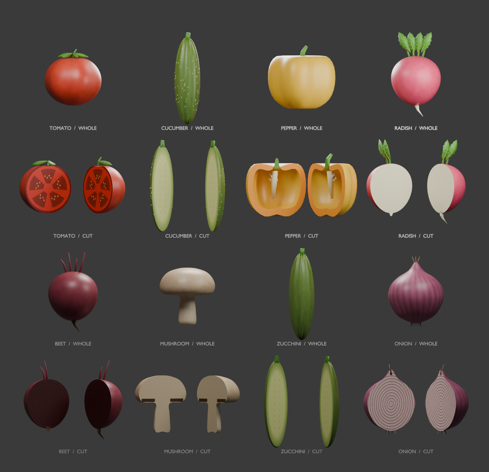

# Developing Typeslasher

Typeslasher explores a simple idea: make keyboard practice feel like a small arcade game. Typing a recognizable food name produces a visible reward: the food splits into modeled pieces. Paragraph practice extends that idea into preparing and serving a meal.

This account is reconstructed from the saved plans, source files, art reviews, and release checkpoints. Those records describe the evolution of the project; the initial GitHub commit is a snapshot of version 1.6, not a recreated commit history.

## 1. Establish the typing loop

The initial plan prioritized a playable loop before polished art: select a target by its first letter, finish its name, slice it, and get the next target. The project uses TypeScript, Three.js, and semantic HTML/CSS, with Vite for development and production builds.

Gameplay and practice logic are split into focused modules for timing, challenge, progression, rhythm, preferences, and learning records. Active targets have distinct first letters so selecting a food is unambiguous. Longer names receive more typing time. Pause and resume handling keep time away from the keyboard out of the results.

## 2. Replace simple food shapes with modeled assets

The first eight foods became an editable Blender pack. Each food has an intact model and two complementary cut pieces, including visible interiors. Python scripts build and export the geometry, materials, and textures as browser-ready GLB files.

Art review was iterative. Saved revisions document the move to a brown whole kiwi with a green interior, more recognizable apple proportions, and ruby grapes with pink flesh. A later pineapple revision added a more detailed rind and layered crown. The interactive food studio reviews the exported models using the game's loader and lighting, because a Blender render alone does not establish how an asset will look in the browser.

## 3. Make practice approachable

Finger guidance, home-row drills, adjustable pace, and local learning records support short practice sessions. The arcade interface developed through a separate home/setup/results prototype before being connected to real rounds. It introduced the plum, cream, yellow, and mint palette, food basket trays, large controls, and clearer paths into play.

Comfort and performance are part of the implementation: reduced motion, optional camera nudges, separate audio controls, graphics presets, idle rendering, and deliberate resume countdowns. A narrow layout is available, but gameplay still expects a physical QWERTY keyboard.

## 4. Add paragraph practice and the kitchen

Sentence Slash accepts a pasted paragraph, a local text file, or a built-in passage. It previews cleaned text and offers forgiving letter case or exact case while preserving punctuation. Completing a word triggers an ingredient cut; completing a sentence serves a bowl.

A generated kitchen concept guided the Blender scene. It was modeled as editable geometry through the connected Blender MCP, then refined with daylight, textured counters, a sink, plants, utensils, and an open bowl. The scene loads when paragraph practice starts.

One important iteration addressed fast typing: decorative cuts could build up behind the player's input. The final behavior keeps the latest pending cut, counts every typed word, and clears waiting cuts at sentence completion. The knife cuts before the pieces separate and land in the bowl; a short rest prevents the next ingredient from appearing too soon. Serving and pause time are excluded from typing speed and freshness clocks.

## 5. Expand content and round progression

The catalog grew from eight to 26 foods and then to 50. The final expansion added Garden harvest, Fruit market, and Pantry & comfort, including hollow peppers and pumpkins, fruit stones, pomegranate seed chambers, bread crumb, and onion rings. Generated whole/cut reference sheets helped define the target anatomy; the playable assets are exported 3D models.

Version 1.5 introduced 30/60/90-second rounds, clearer pause actions, and successive Arcade rounds. Version 1.6 connected the expanded packs to setup, the studio, saved records, and ten kitchen recipe baskets. Packs load according to the selected basket or recipe.

## Tools and their roles

| Tool | Role |
| --- | --- |
| Codex | AI-assisted planning, implementation, debugging, documentation, and iterative project work. Saved model recommendations are planning guidance, not proof that every suggested model was used. |
| TypeScript | Typed gameplay, UI, input, state, and scoring logic. |
| Three.js | Browser rendering, model loading, food animation, lighting, and the kitchen scene. |
| HTML/CSS | Menus, typing text, keyboard guides, settings, and responsive layouts. |
| Vite / Node.js / npm | Development server, dependency management, static builds, and check scripts. |
| Blender / Blender MCP | Editable 3D foods and kitchen, visual inspection, and scene refinement. |
| Python | Modeling, texture generation, GLB export, and review/menu renders. |
| Built-in image generation | Kitchen concepts and food anatomy reference sheets. These are documented separately from final game assets. |
| Web Audio API | Procedural music, synthesized effects, and beat timing. |
| Browser testing | Playthroughs, layout checks, exported asset inspection, and console review. |

The workflow combines human direction and review with AI assistance. AI tools participated in development; the game does not make AI requests during play.

## Validation and limitations

`npm run check` runs 14 suites covering timing, Arcade progression, learning records, challenge selection, audio/settings, rhythm, paragraph cleanup and scoring, kitchen sequencing, catalog rules, and all food packs. Asset checks inspect named roots, cut partitions, normals, anatomy, textures, and size budgets.

`npm run build` type-checks and creates the static site. `npm run check:release` verifies portable links, local fonts and licenses, and release size budgets. The release checkpoints also document browser checks of slicing, paragraph completion, pause/retry, and narrow layouts. These checks do not establish universal browser compatibility, low-end device performance, or educational effectiveness. Further device and player testing remains useful.

## Source records

- [Initial gameplay plan](../PLAN.md)
- [Interface audit and refresh plan](../UI_REFRESH_PLAN.md)
- [Paragraph gameplay plan](../PARAGRAPH_GAMEPLAY_PLAN.md)
- [Food expansion plan](../FOOD_EXPANSION_PLAN.md)
- [Saved release checkpoints](../STATUS.md)
- [Kitchen reference prompt](../design/kitchen-v2/REFERENCE_PROMPT.md)
- [Food reference prompts](../design/food-expansion/PROMPTS.md)
